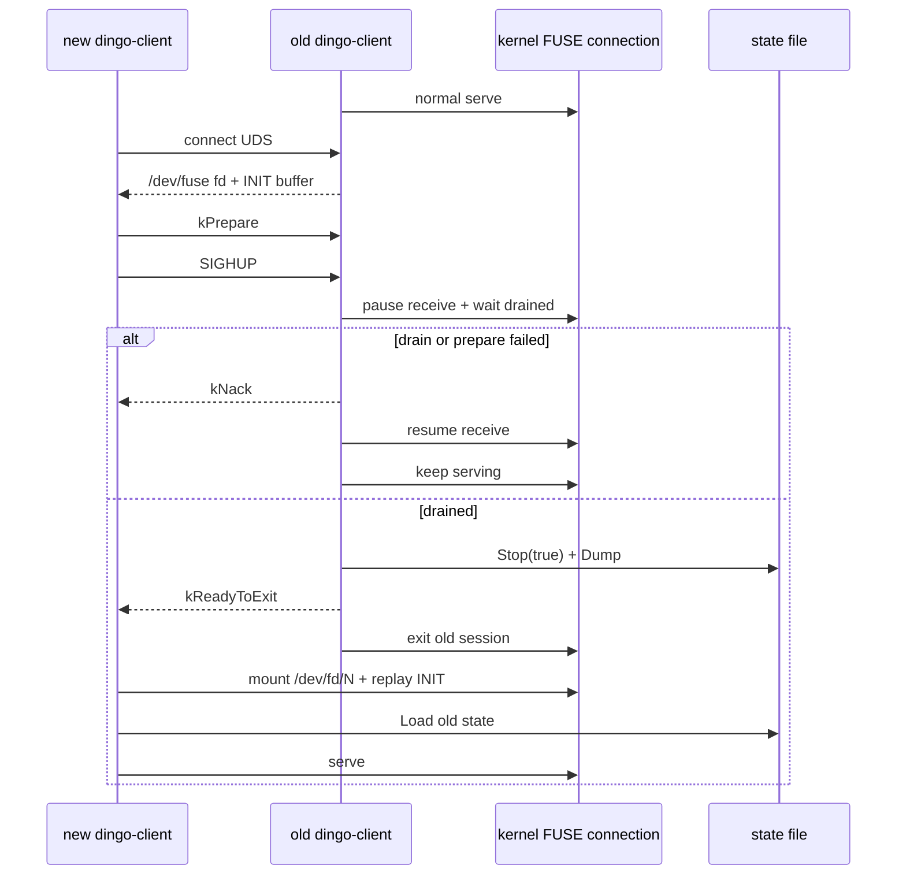
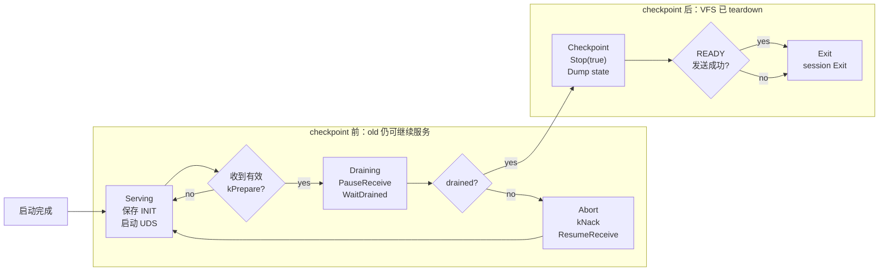
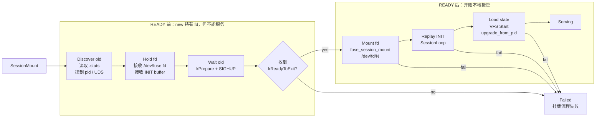

# DingoFS dingo-client 热升级实现说明

## 1. 结论

DingoFS 这版热升级做的是同一条 FUSE connection 上的进程接管：挂载点不重新 mount，`/dev/fuse` fd 通过 UDS 传给新 dingo-client，新进程用 `/dev/fd/N` 复用旧连接继续服务。

相对早期“传 fd 后让旧进程退出”的做法，当前代码补了几个控制点：

- 旧进程不再收到裸 SIGHUP 就立刻退出，而是先确认新进程已经通过 UDS 发送 `kPrepare`。
- 旧进程通过 libfuse controlled drain 停止继续读新请求，并等待已经读出的请求处理完。
- drain 成功后，旧进程执行 `Stop(handover=true)`，释放运行时资源并 dump VFS 状态。
- 新进程复用旧进程传来的 `/dev/fuse` fd 和 INIT buffer，再加载旧进程 dump 的状态。
- drain 或 prepare 阶段失败时，旧进程可以 `resume_receive` 继续服务。

这版还不是完整事务化热升级。分水岭在 checkpoint：一旦进入 `Stop(true) + Dump`，old 已经拆掉 VFS，后面 new 失败时 old 不能自动恢复服务。

## 2. 早期热升级流程

早期流程的基础是复用 FUSE connection，而不是重新 mount：

1. 旧进程正常 mount，持有 `/dev/fuse` fd。
2. 旧进程在 UDS 上等待新进程连接。
3. 新进程从挂载点 `.stats` 中找到旧进程 pid 和 UDS path。
4. 新进程连接旧进程 UDS，通过 `SCM_RIGHTS` 接收 `/dev/fuse` fd，同时接收旧进程保存的 INIT request buffer。
5. 新进程给旧进程发 SIGHUP。
6. 旧进程收到 SIGHUP 后退出 FUSE loop，不卸载真实挂载点，执行 VFS `Stop(true)` 并 dump 状态。
7. 新进程用 `/dev/fd/N` 调用 `fuse_session_mount()`，让 libfuse 复用这条已存在的 FUSE connection。
8. 新进程 replay INIT buffer，触发自己的 `FuseOpInit()`，再从旧进程 dump 的状态文件恢复 VFS。

fd handoff 能保住 FUSE connection，靠的是内核 `struct file` 引用计数和 `SCM_RIGHTS` 传 fd 时的引用接力。只要 old 把 `/dev/fuse` fd 传给 new，并且 new 在 old 退出前成功持有这个 fd，内核侧 FUSE connection 就不会因为 old 进程退出而立刻消失。

### 2.1 早期流程的问题

这个流程可以跑通正常接管，但并发 IO 和失败路径上有几个问题。

#### 2.1.1 没有受控 drain，已读请求可能丢失

先看 FUSE 请求的位置：

- pending：仍在内核 FUSE connection 队列中，任何持有 fd 的服务进程后续都可能读到。
- processing：旧进程已经从 `/dev/fuse` read 出来，但还没有 reply。

fd handoff 只能保证 pending 请求还在内核队列里。old 已经 read 出来的 processing 请求已经离开内核 pending 队列，新进程拿到同一个 fd 也读不到。old 如果在这些请求 reply 前退出，对应应用 syscall 可能长时间阻塞或失败。

clone fd 模式下问题更复杂：不同 worker 可能阻塞在不同 fuse_dev 上。只看主 fd 或只调用 `fuse_session_exit()`，不能证明所有 clone worker 都已经停止读请求，也不能证明所有已读请求都已经 reply。

#### 2.1.2 裸 SIGHUP 语义过弱

旧设计里 SIGHUP 同时承担“触发升级”和“让旧进程退出”的含义。问题是：

- 如果没有真实的新进程连接，裸 SIGHUP 也可能让旧进程进入退出流程。
- 旧进程不知道新进程是否已经拿到 fd。
- 旧进程不知道新进程是否真的准备接管。
- 失败路径缺少明确的 NACK/resume 语义。

热升级需要的是一个协议状态机，而不是一个裸信号。

## 3. 设计要点

当前实现按 checkpoint 分界：checkpoint 前失败，old 尽量回到正常服务；checkpoint 后失败，不再承诺自动回滚。

### 3.1 fd handoff 只解决连接保活，不解决请求安全

`SCM_RIGHTS` 传 `/dev/fuse` fd 只是复制 fd 引用，让新进程也持有同一条 FUSE connection。它能避免旧进程退出时连接立刻断开，但不能处理旧进程已经 read 出来的请求。

所以 fd handoff 只是前提，请求安全靠 controlled drain。

### 3.2 controlled drain 解决“旧进程手里还有请求”的问题

旧进程在退出前需要：

1. 暂停继续从 FUSE fd 读取新请求。
2. 等已经 read 出来的请求全部处理完成。
3. 确认 worker 不再阻塞在 read 路径上继续拿新请求。
4. 成功后才允许进入 checkpoint。

DingoFS 用 libfuse controlled drain 接口完成这件事：

- `fuse_session_pause_receive`
- `fuse_session_resume_receive`
- `fuse_session_received_inflight`
- `fuse_session_wait_drained`

同时，DingoFS 侧用周期性 `statfs(mountpoint)` 作为 wakeup 手段，把阻塞在 read 上的 worker 顶出来，让它们回到 pause 检查点。

这里有一个实现细节：statfs wakeup 线程不能在 drain 返回路径上 join。session 已经 pause 后，statfs 请求可能进了 FUSE pending 队列但没人读；如果 drain 超时路径 join 这个线程，controller 会卡在 join，后续 `kNack` 和 `ResumeReceive()` 都发不出去。当前处理是 stop + detach，等 resume 或新进程接管后，pending statfs 被处理，线程再自己退出。

### 3.3 UDS 握手替代裸 SIGHUP

新设计里，SIGHUP 只是唤醒旧进程 handover controller 的手段，不再单独代表“开始升级”。

升级协议由 UDS 上的 4 字节 magic message 表示：

| 消息 | 含义 |
|---|---|
| `kPrepare` | 新进程已经连接并准备接管，请旧进程进入 handover 流程 |
| `kReadyToExit` | 旧进程已经完成 drain 和 checkpoint，准备退出 |
| `kNack` | 旧进程拒绝本次 handover，新进程应失败退出 |

这避免了“一个信号就触发退出”的问题。SIGHUP 到达后，old 还必须能从当前 UDS peer 上读到 `kPrepare`，否则不会进入 drain。

当前代码时序如下，不是理想两阶段设计：

1. 旧进程 UDS server `accept()` 新连接。
2. 在发送 fd 之前先检查是否已经 committed、是否已有 live handover、INIT buffer 是否已经保存。
3. 旧进程先 `SetClientFd(client_fd)`。
4. 旧进程立刻通过 `SendFd()` 把 `/dev/fuse` fd 和 INIT buffer 发给新进程。
5. 新进程收到 fd 后，才在同一条 UDS 连接上发送 `kPrepare`。
6. 新进程随后 `kill(old_pid, SIGHUP)`，唤醒旧进程 controller。
7. 旧进程 controller 收到 SIGHUP 后，必须从已保存的 `client_fd_` 上读到 `kPrepare`，否则忽略这次 SIGHUP。

当前代码是：**fd/INIT 先给 new，new 先持有连接引用；`kPrepare + SIGHUP` 才触发 old drain**。fd 先给只是为了保住内核连接，不表示服务权已经切走。

### 3.4 checkpoint 负责把用户态状态转移给新进程

drain 只处理 FUSE 请求，不迁移 DingoFS 用户态状态。还需要迁移：

- client id
- mount root 信息
- open handle 的身份信息
- metadata system 状态
- epoch / first start time

当前 checkpoint 由 `FuseOpInit()` 注册，实际执行的是 `g_vfs->Stop(handover=true)`。`VFSWrapper::Stop(true)` 先调用底层 VFS stop，再 dump 状态文件。new 在 `VFSWrapper::Start(config, upgrade_from_pid)` 中读取该状态。

### 3.5 checkpoint 前的失败处理

新设计已经能处理 checkpoint 前的失败：

- 没有 `kPrepare`：旧进程忽略 SIGHUP，继续服务。
- drain 超时：旧进程发 `kNack`，`resume_receive`，继续服务。
- handover peer 失效：新进程连接 UDS 后提前退出、关闭连接，或没有在超时时间内发送有效 `kPrepare`；旧进程关闭 handover client fd，不进入 drain/checkpoint，继续服务。

checkpoint 之后的不可回滚场景统一放到“当前限制”里说明。

## 4. 当前代码实现

这一节只保留和实现关系最紧的主链路。细节按代码入口分散在 `fuse_server`、`handover_*`、`vfs_wrapper`、`vfs_hub` 和 `handle_manager` 中。

### 4.1 主流程图

这张图只画进程边界和内核连接的交互。注意两个时序点：

- old 侧是在 `SaveOpInitMsg()` 成功后才启动 UDS server，新进程不会拿到空 INIT。
- `kReadyToExit` 是 old 的最终 READY 通知。发送这条消息前 old 已经完成 `Stop(true) + Dump`，发送后不再等待 new 回应，而是退出 old session。

### 4.1.1 old 进程内部流程

old 侧的回滚边界在 checkpoint 之前。`WaitHandoverPrepare()` 或 drain 失败时，old 不进入 `Stop(true)`；checkpoint 之后，VFS 已经拆掉，失败不再能自动恢复到继续服务。

### 4.1.2 new 进程内部流程

new 侧 `Handshake()` 成功只表示已经收到 old 的 `kReadyToExit`。`/dev/fd/N` mount、INIT replay、VFS Load 都在 `TakeOver()` 返回之后。`TakeOver()` 内部失败会关闭收到的 fd；`TakeOver()` 成功后的 mount/load 失败属于后续挂载流程失败，通常需要进程退出或人工处理。

### 4.2 失败行为

这一节按回滚边界看，不按函数调用点逐条展开。

1. **prepare 没成立**

   典型场景：old 收到 SIGHUP，但 UDS 上没有有效 `kPrepare`；或者 new 连接 UDS 后退出、关闭连接、超时不发 `kPrepare`。

   old 不进入 drain，也不执行 checkpoint。`HandoverController` 忽略这次 handover，或者关闭当前 handover client fd 后继续服务。

   new 如果还在，会在等待 old 消息时失败；如果已经退出，本次接管自然结束。

2. **drain 没成功**

   典型场景：`WaitDrained(timeout)` 超时，或者 controlled drain 返回失败。

   old 发送 `kNack`，调用 `ResumeReceive()`，状态切回 `kFuseNormal`，继续服务。statfs wakeup 线程在这里只 stop + detach，不 join，避免 controller 卡死在 pending statfs 上。

   new 收到 `kNack` 后 `TakeOver()` 失败，关闭已经收到的 `/dev/fuse` fd，并退出本次挂载流程。

3. **checkpoint 期间 peer 断开**

   典型场景：drain 已经成功，old 进入 `Stop(true) + Dump`，但 new 在这段时间退出或关闭 UDS。

   old 已经过了可回滚点。等 old 走到 commit 阶段，`kReadyToExit` 可能发送失败；当前代码只记录错误，然后继续 `session_->Exit()`，不会 resume。

   new 收不到 READY，本次 `TakeOver()` 失败。如果 new 已经退出，最终 old/new 都不会继续服务这个 mount，需要重挂或人工介入。

4. **READY 后 new 本地接管失败**

   典型场景：new 已经收到 `kReadyToExit`，但后续 `fuse_session_mount(/dev/fd/N)`、INIT replay 或 VFS state load 失败。

   old 在发送 READY 前已经完成 checkpoint，发送 READY 后也不会等 new 回应，已经退出或正在退出。new 本地接管失败后，没有 old 可以自动接回服务，需要重挂或人工介入。

## 5. 当前已经补上的问题

| 分类 | 早期问题 | 当前处理 |
|---|---|---|
| 协议触发与反馈 | 裸 SIGHUP 触发语义弱，失败路径缺少明确反馈 | SIGHUP 只唤醒 controller；是否进入交接取决于 UDS `kPrepare`，结果通过 `kReadyToExit` / `kNack` 表达 |
| 请求 drain 安全 | 已读请求可能丢失；worker 卡在 read 时，单纯 pause 不足以证明可交接 | 引入 libfuse controlled drain；DingoFS 侧周期性 statfs wakeup，并以 `WaitDrained()` 作为交接判断 |
| drain 超时恢复 | statfs wakeup 线程可能卡在 paused session 的 pending statfs 上，join 会卡死 controller | drain 成功和超时路径都 stop + detach wakeup 线程；超时后 controller 继续发送 `kNack` 并 `ResumeReceive()` |
| 失败回滚 | drain 失败后旧进程无法恢复服务 | checkpoint 前失败会发送 `kNack`，调用 `ResumeReceive()`，状态回到 `kFuseNormal` |
| 状态文件可靠性 | 状态文件在 `/tmp`，且存在半写风险 | 改到 data dir，并采用 temp + fsync + rename + fsync dir 原子发布 |
| INIT buffer 生命周期 | 保存 INIT 后没有释放 public receive buffer | `SaveOpInitMsg()` 处理完 INIT 后正确 `free(fbuf.mem)` |

## 6. 当前限制

当前实现不是完整事务化热升级。原因很具体：checkpoint 仍然是 `Stop + Dump`，并且发生在 `kReadyToExit` 之前。一旦 checkpoint 执行，old 的 VFS 已经拆掉，后续 new 失败时，old 无法恢复服务。

所以这版适合的前提是：MDS 和对象后端健康、同一挂载点只做一次升级、old/new 状态格式兼容。在这些前提下，它可以做 graceful handover；它不能覆盖任意失败点。

### 6.1 checkpoint 后不可回滚

checkpoint 现在执行的是 `Stop(true)`。这一步会拆 VFS 组件、释放 handle 运行时资源，并 dump 状态。它不是“只 flush 不 teardown”的可回滚 gate。

因此：

- checkpoint 前失败可以回滚：例如没有有效 `kPrepare`、drain 超时、handover peer 失效，old 会忽略本次 handover，或者 `ResumeReceive()` 后回到 `kFuseNormal` 继续服务。
- checkpoint 后失败不能自动回滚：`Stop(true)` 已经拆掉 VFS，old 不再具备完整恢复服务的条件。典型场景包括 dump 失败导致 old 侧 fatal、old 发送 `kReadyToExit` 失败后仍继续退出、new 收到 READY 后 mount/load 失败。

### 6.2 READY 不是 new 已经可服务

old 发送 `kReadyToExit` 前已经完成 Stop/Dump。new 收到 `kReadyToExit` 后，`Handshake()` 就返回成功，随后才继续做：

- 成功 mount `/dev/fd/N`
- 成功 replay INIT
- 成功 load VFS state
- 进入 serving 状态

所以 `kReadyToExit` 的语义只是：old 已经完成 checkpoint，准备退出。它不表示 new 已经可服务。

代码里 `NotifyReadyToExit()` 只发送一次 `kReadyToExit`，不等 new 回应。发送成功后 old 继续 `session_->Exit()`；发送失败也只是记录错误，然后继续退出。READY 发送失败通常意味着 new 已经退出、关闭 UDS，或者接管流程中断。因为这个调用点已经在 checkpoint 之后，old 没有完整恢复服务的条件，所以这个场景下 old/new 都不会继续服务，需要重挂或人工介入。

如果 new 在收到 READY 后 mount/load 失败，old 已经退出或正在退出，new 也没有完成接管，挂载点同样需要重挂或人工介入。要把这条路径做成强事务，teardown 必须后移到 new mount/load ready 之后。

### 6.3 metadata flush 无界问题仍是生产约束

当前 checkpoint 进入 `Stop()` 后，metadata flush 如果遇到 MDS 长时间不可达，可能无界等待。这样会造成：

- old 卡在 checkpoint。
- new 等不到 `kReadyToExit`。
- 挂载点可能进入长时间不可用或半升级状态。

所以当前版本应该只在 MDS 和对象后端健康时做热升级。

### 6.4 handle 恢复失败只记录 error

HandleManager dump 的是 `ino/fh/flags`。new load 时会逐个调用 `NewHandle(fh, ino, flags)` 重建 handle 运行态。

按最新代码看，`FileReader::Open()` 和 `FileWriter::Open()` 目前基本只初始化后台任务并返回 OK，所以常规路径下 handle load 不太容易失败。`NewHandle()` 返回空的路径主要是：

- writable handle 重建 writer 时，`WriterTable::AcquireWriter()` 发现 writer table 已经 stopped；
- `FileWriter::Open()` 或后续 reader/writer open 逻辑如果变成真实资源初始化，可能返回失败；
- `HandleManager::AddHandle()` 发现 handle manager 已经 stopped。

当前代码的选择是：如果某个 `NewHandle()` 返回空，`HandleManager::Load()` 只打印 `LOG(ERROR)`，然后 `continue` 处理后面的 handle，最后仍然可能 `return true`。这里不是 fail-stop 语义，而是“尽量恢复，失败项记日志”。

如果出现单个 fh 恢复失败，内核侧可能仍持有这个 fh，但 new 用户态没有对应 handle，后续访问会表现为 bad fd 或异常 IO。当前实现接受这个风险，不把它作为整体接管失败条件。

### 6.5 状态格式缺少 schema version

状态文件还需要补 `schema_version` 和兼容性校验。跨版本热升级时，如果状态字段新增、删除或语义变化，new 应该能明确判断“可兼容读取”还是“拒绝接管”，而不是只靠发布和部署策略保证 old/new 状态格式一致。

## 7. 总结

DingoFS 当前实现已经不再是简单 fd handoff。它有 UDS prepare、controlled drain、checkpoint、READY/NACK 和 checkpoint 前的回滚路径，能避免早期“old 直接退出导致已读请求丢失”的主要问题。

使用上要记住分水岭：checkpoint 前失败，old 可以继续服务；checkpoint 后失败，就需要重挂或人工介入。后续要补的是独立的、有界的 `FlushForHandover`，以及 teardown-after-ready 的强提交语义。
