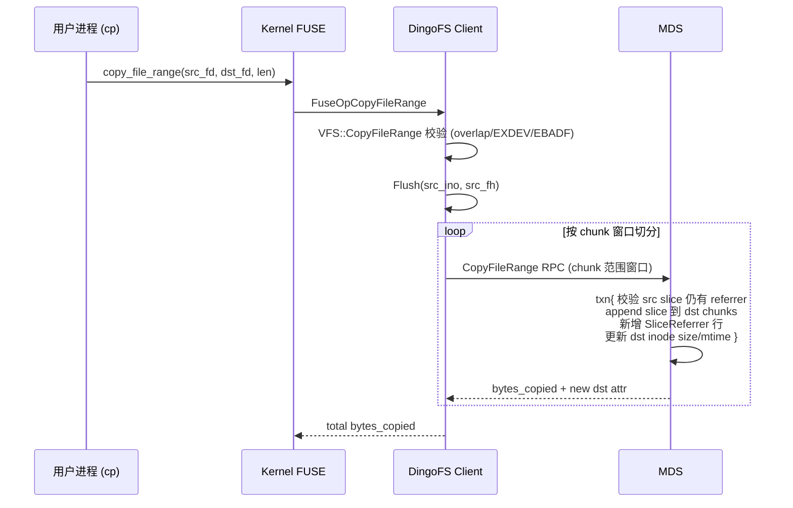

# feat: FUSE copy_file_range 元数据级快速拷贝

## Overview

实现 FUSE `copy_file_range(2)` 操作。利用 DingoFS 底层 slice/block 不可变的特性，**只复制 slice 元数据引用，不拷贝底层数据 block**，让 GB/TB 级文件拷贝退化为 O(slice 数) 的元数据操作。

为了保证跨 inode 共享 slice 的安全性，新增 **SliceReferrer 反向索引** keyspace 与配套的 GC/compact/unlink 路径改造（见 origin 附录 A）。

## Problem Frame

当前 FUSE op `copy_file_range` 槽位为 `nullptr`（`src/client/fuse/fuse_lowlevel_ops_func.h:74`），用户态 `cp` 等程序拷贝大文件会回退到 read+write 慢路径，全部数据要从对象存储读到客户端再写回。

## Requirements Trace

- R1. 拷贝耗时与文件大小解耦，仅与 slice 条数线性相关（origin §1）
- R2. 完全对齐 Linux `copy_file_range(2)` 语义：跨/同文件、任意 (src_off, dst_off, len)（origin §3）
- R3. 拷贝后 src/dst 互相独立——任一方修改不可见于另一方（origin §1）
- R4. 不出现"slice 已被 GC，dst 读到坏数据"的悬挂引用（origin §1）
- R5. 升级兼容：老 slice 走旧 GC 路径，不破坏既有数据安全（origin 附录 A.5）
- R6. 错误码语义对齐 Linux `copy_file_range(2)`：`flags!=0`/同文件 overlap → `EINVAL`；跨 fs → `EXDEV`；src 是目录 → `EISDIR`；并发冲突 → `EAGAIN`；后端不支持 → `EOPNOTSUPP`

## Scope Boundaries

- 不实现 ioctl `FICLONE` / `FICLONERANGE`（origin §1 非目标）
- 不引入用户可见的快照 / clone 概念
- 不支持跨 fs_id 拷贝（返回 `EXDEV`，让内核走慢路径）
- 不实现物理用量精算（仅做逻辑配额准确，origin 附录 A.8）

### Deferred to Separate Tasks

- 升级时一次性扫描回填老 slice 的 SliceReferrer：本期采用宽松方案不回填；如未来需要支持老文件 reflink，单独迭代
- 物理用量统计：可作为离线工具或后续 ChangeRequest

## Context & Research

### Relevant Code and Patterns

**FUSE 客户端层**：
- `src/client/fuse/fuse_op.h:1076` — `FuseOpCopyFileRange` 已声明未实现
- `src/client/fuse/fuse_lowlevel_ops_func.h:74` — `copy_file_range` op slot
- `src/client/fuse/fuse_op.cc:628` — `FuseOpWrite` 模式可参考（参数解包 → `g_vfs->Xxx` → reply）

**VFS 层**：
- `src/client/vfs/vfs.h` — 抽象接口
- `src/client/vfs/vfs_impl.{h,cc}`、`vfs_wrapper.{h,cc}` — 默认实现 + tracing/metric 包装

**MetaSystem 层**：
- `src/client/vfs/metasystem/meta_system.h` — 抽象接口（`WriteSlice`/`ReadSlice` 现有方法可参考）
- `src/client/vfs/metasystem/{mds,memory,local}/metasystem.cc` — 三种实现（dummy 可只返回 NotSupport）
- `src/client/vfs/metasystem/mds/mds_client.cc:1387` — `WriteSlice` RPC 客户端模板

**MDS 端**：
- `src/mds/common/codec.{h,cc}` — `MetaCodec`，已预留 `kMetaFsSliceRef(=29)` 但未使用
- `src/mds/filesystem/store_operation.cc:1097` — `UpsertChunkOperation`（即 WriteSlice 的 op 实现，名称易混淆，注意）
- `src/mds/filesystem/store_operation.cc:1253` — `CompactChunkOperation`
- `src/mds/filesystem/store_operation.cc:1983` — compact 时生成 `TrashSliceList` 写 `DelSlice` 队列
- `src/mds/background/gc.cc` — `CleanDelSliceTask`、reserve_time 480s 后真删 block
- `src/mds/service/mds_service.cc:2110` — RPC handler 模式
- `src/mds/filesystem/filesystem.cc:2369` — `FileSystem::WriteSlice` 业务层入口

**Proto**：
- `proto/dingofs/mds.proto:1214` — `WriteSliceRequest/Response`
- `proto/dingofs/mds.proto:1719` — `MDSService` 服务定义

### Institutional Learnings

- 无 `docs/solutions/` 现有条目（首次实现 reflink 类能力）

### External References

- Linux `copy_file_range(2)` man page — 同文件 overlap 自 5.3 起允许非重叠区间，重叠区间返回 `EINVAL`；flags 必须为 0，否则 `EINVAL`；len 自动截断到 src 文件末尾

## Key Technical Decisions

| 决策 | 选择 | 理由 |
|---|---|---|
| 跨 inode slice 生命周期保护 | 新增 `SliceReferrer` keyspace（拍扁式 B1） | 增删 referrer 单行无 RMW，事务冲突最小（origin 附录 A.3） |
| 与现有 `kMetaFsSliceRef` 关系 | **不复用**（语义不同：refcount vs 反向索引），但复用 codec.cc 编码套路；`SliceReferrer` 用新的 `kMetaFsSliceReferrer` table id | 数据结构语义清晰；后续是否合并 ref_count 短路留作优化 |
| Owner 登记位置 | `UpsertChunkOperation` 为新 slice 同 txn 写一条 SliceReferrer | 与 reflink 用户对等，GC/compact 逻辑统一 |
| 历史兼容 | 宽松方案：fs 级元数据持久化 `min_referrer_slice_id`，老 slice 走旧 GC 路径，禁止参与 reflink | 实现简单，无需大规模回填扫描（origin 附录 A.5） |
| 单 RPC 大事务 | 客户端按 chunk 窗口切分，MDS 侧用 `mds_copy_file_range_max_chunks_per_rpc`（默认 256）配置上限 | 避免单事务过大导致 KV commit 超时（origin 附录 A.4.2） |
| src 脏数据一致性 | 客户端在发 RPC 前先 `Flush(src_ino, src_fh)` | 保证拷贝看到 src 已提交的全部 slice（origin §2 表 4） |
| dst 已有数据 | append 新 slice，旧 slice 由后续 compact 自然清理（SliceReferrer 保护） | 与 `WriteSlice` 现有路径一致 |
| 配额 | 仅按逻辑大小计入 `used_bytes`；物理 block 共享不参与统计 | 与 fallocate 一致；本期不实现物理统计 |
| 同文件 overlap | 客户端校验：src_ino == dst_ino 且范围相交 → 返回 `EINVAL` | 对齐 Linux 5.3+ 内核行为 |
| 跨 fs 拷贝 | 客户端校验：本 mount 与 dst 不同 fs → `EXDEV` | 让内核走慢路径 |
| 隔离级别 | SnapshotIsolation（与 `UpsertChunkOperation` 一致） | 与并发 compact/unlink 自然冲突检测 |

## Open Questions

### Resolved During Planning

- 反向索引编码方案 → B1 拍扁式（origin 附录 A.3）
- 老 slice 是否回填 → 不回填，宽松方案（origin 附录 A.5）
- 单 RPC chunk 数上限 → 引入 `mds_copy_file_range_max_chunks_per_rpc=256` 配置
- 配额口径 → 仅逻辑大小（origin 附录 A.8）
- `SliceReferrer` 是否复用 `kMetaFsSliceRef` → 不复用，新增 `kMetaFsSliceReferrer` table id

### Deferred to Implementation

- `kMetaFsSliceReferrer` 的具体 enum 数值（按现有 enum 顺延）
- Quota `used_bytes` 增加的精确扣点（在 `CopyFileRangeOperation` 内 or `FileSystem::CopyFileRange` 业务层）：建议沿用 `WriteSlice` 现有 quota 路径，落地时确认
- `mds_copy_file_range_max_chunks_per_rpc` 实际默认值是否需要按 chunk_size 动态调整
- `min_referrer_slice_id` 的存储位置：建议复用 `FsInfo` 内字段，proto 加字段；落地时确认是否需要单独 KV
- 反向索引修复扫描子任务（origin 附录 A.7）的触发频率

## High-Level Technical Design

> *本节仅为方向性设计示意，供 reviewer 验证整体形状。实施时按代码现状裁剪。*

### 数据流



### SliceReferrer KV 形态

```
key   = {prefix} | kTableMeta | kMetaFsSliceReferrer | slice_id(8B BE) | fs_id(4B) | ino(8B) | chunk_idx(8B)
value = add_time_ns(8B)
```

Scan 语义：`Scan({prefix}|kTableMeta|kMetaFsSliceReferrer|slice_id, limit=1)` 判断"该 slice 还有任何 referrer"。

### compact / unlink 改造伪逻辑

```
for slice s being removed from (ino, chunk_idx):
    if s.id <= fs.min_referrer_slice_id:
        加入 trash_slice_list                   # 老 slice 走旧路径
    else:
        txn.Delete(SliceReferrer{s.id, fs_id, ino, chunk_idx})
        if txn.Scan(SliceReferrer{s.id, *}, limit=1).empty():
            加入 trash_slice_list               # 真没人用了
        # else: 还有别的 referrer, 不进 trash
```

## Implementation Units

### Phase 1：MDS 反向索引基础设施

- [ ] **Unit 1: SliceReferrer codec**

**Goal:** 在 `MetaCodec` 中新增 `kMetaFsSliceReferrer` 编码族，并暴露 prefix scan 帮助函数。

**Requirements:** R4

**Dependencies:** 无

**Files:**
- Modify: `src/mds/common/codec.h` — 新增 `EncodeSliceReferrerKey/DecodeSliceReferrerKey`、`EncodeSliceReferrerValue/DecodeSliceReferrerValue`、`GetSliceReferrerRange(slice_id)`、`IsSliceReferrerKey`
- Modify: `src/mds/common/codec.cc` — `kMetaFsSliceReferrer` enum 值（顺延，建议 30）；编码函数实现；`kSliceReferrerKeySize` 加入初始化
- Test: `test/unit/mds/common/test_codec.cc` — codec round-trip + prefix range 边界

**Approach:**
- 沿用 `EncodeSliceRefKey` 套路，使用 `SerialHelper::WriteLong` 等 BE 编码以保证 prefix scan 顺序正确
- key 结构：`{prefix}|kTableMeta|kMetaFsSliceReferrer|slice_id|fs_id|ino|chunk_idx`
- 全 fs 共享前缀（与现有 `SliceRef` 同位置），无需带 fs_id 前缀

**Patterns to follow:**
- `EncodeSliceRefKey/DecodeSliceRefKey`（`src/mds/common/codec.cc:1020-1036`）
- `GetSliceRefRange`（`src/mds/common/codec.cc:373`）

**Test scenarios:**
- Happy path: 编码 (slice_id=10, fs_id=1, ino=100, chunk_idx=0) → 解码回相同字段
- Edge case: slice_id=0、最大 uint64 边界值
- Edge case: 同 slice_id 下不同 (fs_id, ino, chunk_idx) 编码后按字典序与 (fs_id, ino, chunk_idx) 自然序一致
- Edge case: `IsSliceReferrerKey` 对其他 keyspace 的 key（如 `SliceRef`、`Chunk`）必须返回 false
- Happy path: `GetSliceReferrerRange(slice_id)` 起止 key 能 scan 到该 slice 的所有 referrer，且不会越界到下一 slice_id

**Verification:**
- 单元测试通过；现有 codec 测试无回归

---

- [ ] **Unit 2: FsInfo 增加 min_referrer_slice_id 字段**

**Goal:** 持久化 fs 级 `min_referrer_slice_id`，作为升级兼容分界点。

**Requirements:** R5

**Dependencies:** 无

**Files:**
- Modify: `proto/dingofs/mds.proto` — `FsInfo` message 新增 `uint64 min_referrer_slice_id = N`
- Modify: `src/mds/server.cc` 或 fs 创建/升级路径 — 老 fs 首次启动时若该字段为 0，扫描当前最大 slice_id 写入；新建 fs 时初始化为 0
- Modify: `src/mds/filesystem/filesystem.{h,cc}` — 暴露 `GetMinReferrerSliceId()` 给 operation 使用
- Test: `test/unit/mds/filesystem/`

**Approach:**
- 简单字段，加在 `FsInfo` 末尾保持 proto 兼容
- 升级回填：在 MDS 启动后第一次访问该 fs 时，若 `min_referrer_slice_id == 0` 且 fs 已有数据（通过有无 chunk 判断），则调用 `AllocSliceId` 取当前 max 写入；新 fs 直接默认 0
- 字段一旦置位，不再修改

**Patterns to follow:**
- 现有 `FsInfo` 字段维护方式（参考 `proto/dingofs/mds.proto` 中 FsInfo 已有字段）

**Test scenarios:**
- Happy path: 新建 fs → `min_referrer_slice_id == 0` → 所有 slice 视为新 slice
- Happy path: 模拟"老 fs 升级"路径，记录回填后该字段不再变化
- Edge case: 多 MDS 并发启动时，回填操作应幂等（只第一个生效）

**Verification:**
- 启动后 `GetFsInfo` 能读到正确的 `min_referrer_slice_id`

---

- [ ] **Unit 3: UpsertChunkOperation 集成 SliceReferrer 写入**

**Goal:** 改造 `UpsertChunkOperation`（`WriteSlice` RPC 的实际 op），使每个被新加入 chunk 的 slice 在同一 txn 内写一条 SliceReferrer 行。

**Requirements:** R4

**Dependencies:** Unit 1, Unit 2

**Files:**
- Modify: `src/mds/filesystem/store_operation.cc:1097-1200` — 在 `is_exist_fn` 返回 false 的分支后追加 `txn->Put(EncodeSliceReferrerKey(...), EncodeSliceReferrerValue(now_ns))`
- Modify: 同文件中 `UpsertChunkOperation` 创建新 chunk 分支（`chunk.version() == 0`）— 同样为每个 slice 写一条 SliceReferrer
- Test: `test/unit/mds/filesystem/test_store_operation.cc` 或对应测试文件

**Approach:**
- 仅对 `slice_id > min_referrer_slice_id` 的 slice 写 referrer（避免对老 slice 引入半套数据）
- 必须在已经判定为"新 slice"之后才写，避免幂等重传场景重复 Put（虽然幂等 Put 也不会出错，但可减少 txn 大小）
- value 写入当前时间戳便于审计

**Execution note:** 修改前先把 `UpsertChunkOperation` 的现有单测跑一遍作为基线。

**Patterns to follow:**
- 同 op 内已有 `txn->Put(MetaCodec::EncodeChunkKey(...), ...)`（`store_operation.cc:1277` 等）

**Test scenarios:**
- Happy path: WriteSlice 写入新 slice → 对应 SliceReferrer 行存在，value 时间戳合理
- Happy path: WriteSlice 写入 `slice_id <= min_referrer_slice_id` 的"老" slice id（模拟） → **不**写 SliceReferrer
- Edge case: WriteSlice 同一 slice 重复提交（幂等场景，`is_exist_fn` 命中） → 不重复写 SliceReferrer
- Edge case: 单 RPC 多 chunk 多 slice → 所有新 slice 都正确登记
- Integration: 现有 `UpsertChunkOperation` 测试无回归

**Verification:**
- 现有 WriteSlice 单测全绿；新增的 referrer 校验测试通过

---

### Phase 2：MDS GC / compact / unlink 改造

- [ ] **Unit 4: CompactChunkOperation 接入 SliceReferrer 判定**

**Goal:** compact 时不再无条件把"不在 new_slices 中"的 slice 加入 trash；先在 txn 内删除自己的 SliceReferrer 行，再 scan 是否还有别的 referrer，无则进 trash。

**Requirements:** R4, R3

**Dependencies:** Unit 1, Unit 3

**Files:**
- Modify: `src/mds/filesystem/store_operation.cc:1983-2005` — 改造 trash_slice 生成逻辑
- Modify: `src/mds/filesystem/store_operation.cc` 中 `CompactChunkOperation` 类签名（如需注入 `min_referrer_slice_id`）
- Test: `test/unit/mds/filesystem/test_store_operation.cc`

**Approach:**
- 对每个待删 slice：
  - 若 `slice.id <= min_referrer_slice_id` → 直接 trash（旧路径，跳过 referrer 操作）
  - 否则 → `txn->Delete(EncodeSliceReferrerKey(slice.id, fs_id, ino_, chunk.index()))`，再 `txn->Scan(GetSliceReferrerRange(slice.id), limit=1)`；若空 → trash，否则跳过
- 保持 trash_slice_list 的 `DelSlice` 写入路径不变

**Patterns to follow:**
- 现有 trash 生成代码（`store_operation.cc:1983-2005`）
- `txn->Scan` 调用模式（搜索 `txn->Scan` 在同文件内其他用法）

**Test scenarios:**
- Happy path: compact 后唯一 referrer 的 slice 进 trash
- Happy path: 被 reflink 共享的 slice 在 src compact 时 **不**进 trash，且对应 referrer 行被删
- Edge case: `slice.id <= min_referrer_slice_id`（老 slice）走旧路径直接 trash，无 referrer 操作
- Edge case: 同一 chunk 内多 slice 混合（部分共享部分独占），各自正确分流
- Integration: compact 后 dst 仍能正常读取共享数据（需 vfs 层端到端测试或在 mds 层 mock）

**Verification:**
- 测试通过；现有 compact 单测无回归；不会出现"共享 slice 被误删"的场景

---

- [ ] **Unit 5: Unlink / DeleteFile 路径接入 SliceReferrer 判定**

**Goal:** unlink 一个文件时，同样按 SliceReferrer 判定决定是否真删 block。

**Requirements:** R4, R3

**Dependencies:** Unit 1, Unit 3, Unit 4（同套判定逻辑可复用）

**Files:**
- Modify: 文件删除路径（`src/mds/background/gc.cc` 中 `ShouldDeleteFile` 后 + 文件 chunk 清理；和/或 `src/mds/filesystem/store_operation.cc` 中 unlink 相关 op）
- 抽取公共函数：建议在 `store_operation.cc` 内新增静态 helper `MaybeTrashSlice(txn, fs_id, ino, chunk_idx, slice, min_referrer_slice_id, trash_list)`，Unit 4 与本单元共用
- Test: `test/unit/mds/`

**Approach:**
- 找到当前 unlink 时枚举 inode 全 chunk 写 trash 的位置（参考 `gc.cc:574` `ShouldDeleteFile` 后续清理路径与 `store_operation.cc` `DeleteFileSession` 系列）
- 用 helper 替换原来的 trash 加项逻辑
- unlink 操作本身的事务粒度按现状（每 chunk 一个 op 或聚合，按既有实现）

**Patterns to follow:**
- Unit 4 抽取的 helper

**Test scenarios:**
- Happy path: 删除一个普通文件（无共享 slice） → 所有 slice 进 trash，最终 block 被 GC
- Happy path: 删除 src 文件，dst 仍持有共享 slice → 共享 slice **不**进 trash
- Happy path: 接 Happy 2 后再删除 dst → 此时共享 slice 进 trash
- Edge case: 极大文件（数千 chunk）unlink 性能不显著退化（关注 scan 成本）
- Integration: 端到端 reflink → unlink src → dst 读数据完好

**Verification:**
- 测试通过；reflink 后任意删除顺序数据均不丢

---

### Phase 3：CopyFileRange RPC 与 Operation

- [ ] **Unit 6: CopyFileRange proto 与 RPC 框架**

**Goal:** 在 `MDSService` 中新增 `CopyFileRange` RPC，定义 request/response 消息。

**Requirements:** R1, R2

**Dependencies:** Unit 1（依赖 SliceReferrer 概念稳定）

**Files:**
- Modify: `proto/dingofs/mds.proto` — 新增 `CopyFileRangeRequest/Response`、`MDSService` 增加 RPC 方法
- Modify: `src/mds/service/mds_service.h` 与 `src/mds/service/mds_service.cc` — handler 框架（先返回 `EOPNOTSUPP` 占位）
- Test: 无（占位）

**Approach:**
- Request 字段：`fs_id`、`src_ino`、`dst_ino`、`src_chunk_index_begin`、`src_chunk_index_end`（窗口式，半开区间）、`src_off`（绝对字节偏移）、`dst_off`（绝对字节偏移）、`len`（本窗口请求拷贝字节数）、`flags`、`expected_min_referrer_slice_id`（可选，客户端从最近一次 GetFsInfo 缓存的值，用于一致性校验）
- Response 字段：`bytes_copied`、`Inode dst_inode`（更新后的属性，给客户端刷新缓存）、`Error error`
- 不在 proto 里塞 slice 详情；slice 解析在 MDS 端做（更安全，客户端无需把"src 当前 slice 列表"传上来）

**Patterns to follow:**
- `WriteSliceRequest/Response`（`proto/dingofs/mds.proto:1214-1237`）
- `MDSServiceImpl::DoWriteSlice`（`src/mds/service/mds_service.cc:2110`）

**Test scenarios:**
- 占位单元测试：RPC 注册成功、调用返回 EOPNOTSUPP

**Verification:**
- 编译通过；proto 生成 `*.pb.h` 含新方法

---

- [ ] **Unit 7: CopyFileRangeOperation 实现**

**Goal:** 在 MDS 端实现单窗口的 CopyFileRange 业务事务。

**Requirements:** R1, R2, R3, R4

**Dependencies:** Unit 1, Unit 2, Unit 3, Unit 6

**Files:**
- Modify: `src/mds/filesystem/store_operation.{h,cc}` — 新增 `CopyFileRangeOperation : public Operation`
- Modify: `src/mds/filesystem/filesystem.{h,cc}` — 新增 `FileSystem::CopyFileRange` 业务入口（参数校验、quota 扣减、调用 OperationProcessor）
- Modify: `src/mds/service/mds_service.cc` — `DoCopyFileRange` 调用 `file_system->CopyFileRange`
- Modify: `src/mds/server.cc` 或对应 flag 文件 — 新增 `gflag mds_copy_file_range_max_chunks_per_rpc`（默认 256）
- Test: `test/unit/mds/filesystem/test_store_operation.cc`、`test/unit/mds/filesystem/test_filesystem.cc`

**Approach:**

operation 单 txn 内顺序：
1. `BatchGet`：src inode、dst inode、src 涉及 chunk keys、dst 涉及 chunk keys
2. 校验：src/dst 仍存在、文件类型为普通文件、dst 未被并发 truncate 到不可写区域、`expected_min_referrer_slice_id` 与当前一致
3. 解析 src 在 [src_off, src_off+len) 内的 slice 列表，按 dst chunk_size 重新映射（调整 `pos`、`off`、`len`，按需要在 chunk 边界切分）
4. 校验每个被引用的 src slice 在 SliceReferrer 中存在 (slice_id, fs_id, src_ino, src_chunk_idx)（防止与 src compact/unlink 并发破坏）；不存在 → 返回 EAGAIN 让客户端重试
5. 对每个目标 dst chunk：append 新 slice 到 chunk slices，bump version，`txn->Put(ChunkEntry)`
6. 对每个被引用的 src slice id：`txn->Put(SliceReferrer{slice_id, fs_id, dst_ino, dst_chunk_idx}, now_ns)`
7. 更新 dst inode：`size = max(size, dst_off + bytes_copied)`、mtime/ctime；`txn->Put(InodeEntry)`
8. 上限保护：若本次 RPC 涉及的 dst chunk 数 > `mds_copy_file_range_max_chunks_per_rpc` → 返回 `EINVAL` 让客户端重新切分

quota 扣减：在 `FileSystem::CopyFileRange` 业务层，按"dst size 增量"扣 used_bytes（参考 fallocate / write 现有路径）。

**Execution note:** 先写跨文件简单场景的 happy path 单测，再补 src compact 并发、dst overlap、空隙区域等边界。

**Patterns to follow:**
- `UpsertChunkOperation::Run`（`store_operation.cc:1097`）— 多 chunk BatchGet + Put 模式
- `CompactChunkOperation`（`store_operation.cc:1253`）— slice 列表操作模式
- `FallocateOperation`（`store_operation.cc:971`）— inode size 更新 + quota 模式
- `MDSServiceImpl::DoWriteSlice`（`mds_service.cc:2110`）— RPC handler 模式

**Technical design:** *(directional)*

```
src 在某 chunk c 内的 slices 经裁剪后，每条 slice 提供 [src_chunk_pos, src_chunk_pos + slice.len) 的逻辑数据。
映射到 dst 时：
  dst_logical = dst_off + (src_logical - src_off)
  目标 chunk index = dst_logical / chunk_size
  在目标 chunk 内 pos = dst_logical % chunk_size
slice 字段：
  id   = src_slice.id                   # 关键：复用
  size = src_slice.size                 # 物理大小不变
  off  = src_slice.off + (src_logical 在 slice 内的偏移)
  len  = 本目标 chunk 内能放下的长度
  pos  = 上面计算的 dst chunk 内 pos
若映射跨越 dst chunk 边界，则在边界处把 slice 切成两条，分别落到不同 dst chunk。
```

**Test scenarios:**
- Happy path: 跨文件 (dst_off=0, len=10MB)，dst 为空文件 → bytes_copied=10MB，dst size=10MB，dst chunk 含正确 slice 引用
- Happy path: dst 已有 5MB 数据，dst_off=2MB，len=5MB → dst chunk slice 列表 append 新 slice，旧 slice 仍在（compact 后再清）
- Happy path: 跨多个 chunk，slice 在 chunk 边界被切分
- Edge case: src_off + len > src 文件末尾 → 截断，bytes_copied < len
- Edge case: 本次 RPC 涉及 chunk 数超过上限 → 返回 EINVAL
- Edge case: dst chunk_size != src chunk_size（不同 fs 配置，本期 EXDEV，但单测可注入测试 mapping 函数）
- Error path: src ino 不存在 → ENOENT
- Error path: src 是目录 → EISDIR
- Error path: 与 src compact 并发，referrer 校验失败 → EAGAIN
- Error path: SnapshotIsolation 冲突重试上限耗尽 → 返回错误
- Integration: CopyFileRange 后再读 dst 数据，与 src 完全一致（需 vfs 层端到端测试覆盖）
- Integration: CopyFileRange 后 src 写入新数据，dst 不变；dst 写入新数据，src 不变（CoW 隔离验证）
- Integration: CopyFileRange 后 unlink src，dst 仍可读

**Verification:**
- MDS 单测全绿；端到端覆盖在 Phase 4 完成

---

### Phase 4：客户端接入

- [ ] **Unit 8: MetaSystem & MDSClient CopyFileRange 接口**

**Goal:** 在客户端 MetaSystem 抽象层与 MDSClient 暴露 `CopyFileRange`。

**Requirements:** R1, R2

**Dependencies:** Unit 6

**Files:**
- Modify: `src/client/vfs/metasystem/meta_system.h` — 抽象方法 `CopyFileRange(ctx, src_ino, src_off, dst_ino, dst_off, len, flags, *bytes_copied, *dst_attr)`
- Modify: `src/client/vfs/metasystem/meta_wrapper.{h,cc}` — pass-through + tracing
- Modify: `src/client/vfs/metasystem/mds/metasystem.{h,cc}` 与 `mds/mds_client.{h,cc}` — 实现 RPC 调用，按 chunk 窗口循环（窗口大小 = `mds_copy_file_range_max_chunks_per_rpc` 或客户端 flag）
- Modify: `src/client/vfs/metasystem/memory/metasystem.cc` 与 `local/metasystem.cc` — 返回 `Status::NotSupport("not supported")`（与现有 `Compact` 同模式）
- Test: 客户端 metasystem 单测

**Approach:**
- mds_client：发起 RPC 时携带最近一次缓存的 `min_referrer_slice_id`（可从 GetFsInfo 缓存里取）
- 客户端窗口循环：根据 src/dst chunk_size 计算"本次窗口能覆盖的 chunk 数"，迭代调用 RPC，累计 bytes_copied；若任一 RPC 返回 EAGAIN → 限次重试
- meta_wrapper 中加 tracing span 和 metric 计数

**Patterns to follow:**
- `MDSClient::WriteSlice`（`mds_client.cc:1387`）
- `MetaSystem::Compact`（`meta_system.h:121`）— NotSupport 默认实现模板

**Test scenarios:**
- Happy path: 窗口循环正确累计 bytes_copied
- Happy path: memory/local backend 返回 NotSupport（FUSE 上层应映射为 EOPNOTSUPP）
- Edge case: 窗口为 0（len=0） → 返回 0，不发 RPC
- Error path: RPC 返回 EAGAIN → 重试 N 次后失败
- Error path: 中间窗口失败 → 返回已成功窗口累计的 bytes_copied（POSIX 允许部分拷贝）

**Verification:**
- 客户端 metasystem 单测通过

---

- [ ] **Unit 9: VFS::CopyFileRange 实现**

**Goal:** 在 VFS 抽象层与 vfs_impl 中实现 CopyFileRange，包括 src flush 与参数校验。

**Requirements:** R1, R2, R3

**Dependencies:** Unit 8

**Files:**
- Modify: `src/client/vfs/vfs.h` — 新增虚方法 `CopyFileRange`
- Modify: `src/client/vfs/vfs_impl.{h,cc}` — 实现：参数校验 → Flush(src) → 调 MetaSystem::CopyFileRange → 更新本地 inode 缓存
- Modify: `src/client/vfs/vfs_wrapper.{h,cc}` — tracing/metric/access_log 包装
- Test: `test/unit/client/vfs/`

**Approach:**
- 参数校验顺序：
  1. `flags != 0` → EINVAL
  2. `len == 0` → 返回 0
  3. src_ino / dst_ino 类型校验（必须文件） → EISDIR / EINVAL
  4. 同文件 + 区间相交 → EINVAL
  5. 跨 fs（dst_ino 不属于本 mount 的 fs）→ EXDEV
  6. 权限校验（已由 FUSE 层 + handle 校验，VFS 兜底即可）
- Flush src：调用 `MetaSystem::Flush(src_ino, src_fh)`。若调用方未传 src_fh（理论上 FUSE 总会传），按 ino 触发全 fh flush，或返回 EBADF
- 调用 MetaSystem::CopyFileRange，得到 bytes_copied 与 dst_attr，刷新本地 inode 属性缓存
- atime 不强制更新（按 mount 选项决定）

**Patterns to follow:**
- `VfsImpl::Write`、`VfsImpl::Flush` 当前实现
- `VfsWrapper` tracing 模板

**Test scenarios:**
- Happy path: 跨文件简单拷贝
- Edge case: flags 非 0 → EINVAL
- Edge case: len=0 → 返回 0，不调 MetaSystem
- Edge case: 同文件 src_off=0 dst_off=4096 len=8192（重叠） → EINVAL
- Edge case: 同文件不重叠 → 正常
- Error path: src 是目录 → EISDIR
- Error path: dst 是符号链接 → EINVAL
- Error path: 跨 fs → EXDEV
- Integration: src 有未刷脏页 → CopyFileRange 后 dst 包含已刷数据

**Verification:**
- 单测通过

---

- [ ] **Unit 10: FUSE op 接线**

**Goal:** 实现 `FuseOpCopyFileRange`，挂到 fuse_lowlevel_ops。

**Requirements:** R1, R2

**Dependencies:** Unit 9

**Files:**
- Modify: `src/client/fuse/fuse_op.cc` — 实现 `FuseOpCopyFileRange`
- Modify: `src/client/fuse/fuse_lowlevel_ops_func.h:74` — 把 nullptr 改为 `FuseOpCopyFileRange`
- Modify: `src/client/fuse/fuse_op.h` — 已声明，无需修改
- Test: 端到端集成测试或手工挂载验证

**Approach:**
- 参数：(req, ino_in, off_in, fi_in, ino_out, off_out, fi_out, len, flags) → 调 `g_vfs->CopyFileRange(...)` → `fuse_reply_write(req, bytes_copied)` 或 `ReplyError`
- 注意 `FLAGS_fuse_dryrun_bench_mode` 直接 reply 0 或 len（参考 FuseOpWrite）

**Patterns to follow:**
- `FuseOpWrite`（`fuse_op.cc:628`）

**Test scenarios:**
- Test expectation: none — 仅参数解包/转发，逻辑由 VFS 层覆盖
- Manual: 挂载后 `python -c "import os; ..."` 调用 `os.copy_file_range(src_fd, dst_fd, len)`，验证返回值与 dst 内容

**Verification:**
- 挂载后用户态 `cp --reflink=auto large_file dst`（或 coreutils ≥9 默认 `cp`）能成功且耗时与文件大小弱相关

---

### Phase 5：可观测性 + 文档

- [ ] **Unit 11: 反向索引修复扫描子任务（可选但推荐）**

**Goal:** 在 MDS 后台 GC 增加 SliceReferrer 一致性巡检任务，清理悬挂引用。

**Requirements:** R4

**Dependencies:** Unit 1, Unit 3, Unit 4, Unit 5

**Files:**
- Modify: `src/mds/background/gc.{h,cc}` — 新增 `ScanSliceReferrerTask`，定期 scan SliceReferrer keyspace，验证 `(fs_id, ino, chunk_idx)` 仍真实存在 chunk 且 chunk 仍含此 slice
- Modify: 配置增加 `mds_gc_referrer_scan_interval_s`（默认例如每 6 小时）与 `mds_gc_referrer_scan_enable`（默认 true）
- Test: `test/unit/mds/background/`

**Approach:**
- 巡检低优先级，速率限制；只清"指向不存在的 ino 或 chunk 不含此 slice"的悬挂行
- 不动 trash 路径（trash 由正常路径触发）

**Test scenarios:**
- Happy path: 注入悬挂 referrer → 扫描后清理
- Edge case: 正常 referrer → 不被误删
- Edge case: 扫描限流不卡死

**Verification:**
- 测试通过；日志能打出清理统计

---

- [ ] **Unit 12: 文档与 CHANGELOG**

**Goal:** 更新用户文档与 CHANGELOG，说明 copy_file_range 行为与升级影响。

**Requirements:** R5

**Dependencies:** 所有功能 unit 完成

**Files:**
- Modify: `CHANGELOG.md` 与 `CHANGELOG_CN.md` — 新功能条目，含老 slice 不参与 reflink 的说明
- Modify: `docs/`（如已有用户手册）— 新增 copy_file_range 章节，说明：跨 fs EXDEV、同文件 overlap EINVAL、老 slice 升级行为、quota 计算口径
- Test: 无

**Test scenarios:**
- Test expectation: none — 文档变更

**Verification:**
- 文档清晰，可独立指导用户

---

## System-Wide Impact

- **Interaction graph:**
  - `WriteSlice` 路径增加 SliceReferrer Put（每新 slice +1 KV op）
  - `CompactChunk` / unlink / DeleteFile 路径增加 SliceReferrer Delete + 1 limit-1 Scan（每被删 slice）
  - GC 后台 trash 路径不变；新增独立的 referrer 巡检任务
- **Error propagation:**
  - VFS 层将 `Status::NotSupport` 映射为 `EOPNOTSUPP`（让内核走慢路径）
  - MDS 端 `EAGAIN`（referrer 校验失败、并发冲突） → 客户端有限次重试 → 失败则返回部分 bytes_copied 给用户
  - SnapshotIsolation 冲突由 OperationProcessor 现有机制重试
- **State lifecycle risks:**
  - 中间窗口失败留下"dst 已部分追加 slice"是合法的（POSIX `copy_file_range` 允许部分写）
  - 客户端 crash 在窗口循环中间：dst 处于一致的"部分拷贝"状态，无悬挂；新增的 SliceReferrer 受未来巡检兜底
  - MDS 在事务 commit 后客户端未收到响应：客户端按错误处理（部分写），SliceReferrer 已生效，重复 RPC 可能产生重复 referrer 行 → 因 key 含 (slice_id, fs_id, ino, chunk_idx) 唯一，重复 Put 幂等覆盖 value，安全
- **API surface parity:**
  - 仅 FUSE op；不引入 ioctl；CLI/SDK 暂不暴露
- **Integration coverage:**
  - 端到端：挂载 + cp 大文件 + 校验内容 + 校验耗时
  - 端到端：reflink → unlink src → 读 dst 完好
  - 端到端：reflink → src 写新数据 → src/dst 内容分叉
- **Unchanged invariants:**
  - 现有 `WriteSlice`/`ReadSlice` RPC 字段与语义不变
  - block_key 推导规则不变（仍由 slice_id+slice.size+block_size 决定）
  - 现有 GC 的 `mds_gc_delslice_reserve_time_s`（480s 安全窗口）仍然生效；reflink 路径只是改变了"何时进 trash"的判定，未改变"进 trash 后多久真删"

## Risks & Dependencies

| Risk | Mitigation |
|------|------------|
| compact/unlink 路径修改不全，遗漏某条 trash 加项分支 → 误删共享 block | 抽取 `MaybeTrashSlice` helper，所有 trash 加项强制走 helper；review 时 grep 所有原 trash 加项位置 |
| 升级时已有数据但 `min_referrer_slice_id` 未正确回填 → 把老 slice 当新 slice 处理 → compact 时找不到 referrer 直接误删 | Unit 2 启动回填路径必须先于任何 compact 触发；增加启动期校验日志和告警 |
| 单 RPC 大事务超过 KV 后端限制 | `mds_copy_file_range_max_chunks_per_rpc=256` 上限 + 客户端窗口循环；单测覆盖上限拒绝路径 |
| 同 slice 高频 reflink → SliceReferrer keyspace 行数膨胀 | 拍扁式编码本身无 RMW 冲突；后续可加阈值告警；本期接受 |
| FUSE 协议版本兼容（`copy_file_range` 需要 FUSE 3.4+） | `fuse_lowlevel_ops_func.h:73-75` 已用 `#if FUSE_VERSION >= FUSE_MAKE_VERSION(3, 4)` 守护，保持现状 |
| 老 fs 用户期望老文件也能 reflink | 文档明确说明：老 slice 不参与 reflink；提供"重写一次 + 再 reflink"的 workaround |
| referrer 巡检任务影响线上 KV 压力 | 限流 + 默认低频（6 小时）+ 可关闭 flag |

## Documentation / Operational Notes

- CHANGELOG 注明：copy_file_range 已支持，仅对升级后写入的新 slice 生效
- 运维文档：增加新 gflag 说明（`mds_copy_file_range_max_chunks_per_rpc`、`mds_gc_referrer_scan_*`）
- 监控：增加 SliceReferrer 行数 metric（按 fs 维度）、CopyFileRange RPC 计数与延迟、悬挂引用清理计数
- 升级 runbook：MDS 升级后，确认日志中"min_referrer_slice_id 已回填"信息出现，再放量

## Sources & References

- **Origin document:** [docs/brainstorms/copy-file-range-requirements.md](../brainstorms/copy-file-range-requirements.md)
- 关键源码：
  - `src/client/fuse/fuse_op.h:1076`、`src/client/fuse/fuse_lowlevel_ops_func.h:74`
  - `src/client/vfs/vfs.h`、`src/client/vfs/metasystem/meta_system.h`
  - `src/client/vfs/metasystem/mds/mds_client.cc:1387`（WriteSlice 客户端模板）
  - `src/mds/common/codec.{h,cc}`（已预留 `kMetaFsSliceRef`，本次新增 `kMetaFsSliceReferrer`）
  - `src/mds/filesystem/store_operation.cc:1097`（UpsertChunkOperation = WriteSlice 的 op）
  - `src/mds/filesystem/store_operation.cc:1253`（CompactChunkOperation）
  - `src/mds/filesystem/store_operation.cc:1983-2005`（trash slice 生成位）
  - `src/mds/background/gc.cc`（GC 与 reserve_time）
  - `proto/dingofs/mds.proto:1214-1237`、`:1719-1720`
- 外部参考：Linux `copy_file_range(2)` man page（语义与 EINVAL/EXDEV 行为）
