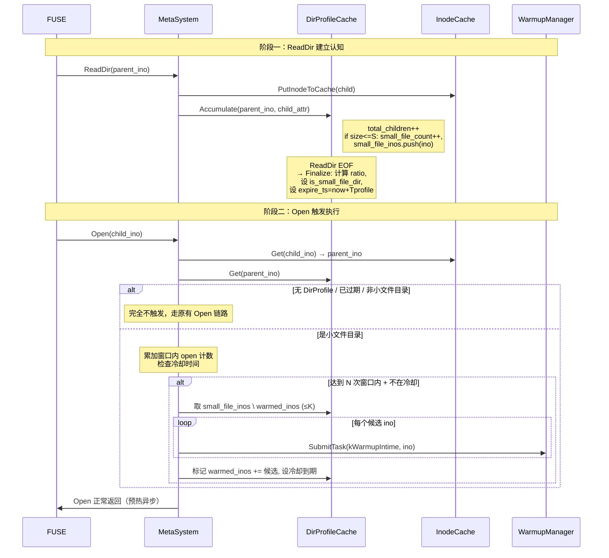

# feat: 客户端小文件目录冷读预热（DirProfile 驱动）

## Overview

在 DingoFS 客户端 metasystem 内增加"目录画像 + 模式触发"的两阶段预热机制：
ReadDir 时建立每目录的 `DirProfile`（统计子项数量、小文件占比、小文件 ino 列表）；Open
时基于父目录的 `DirProfile` 做模式检测，当达到触发条件时调用 `WarmupManager`
对该目录下尚未预热的小文件批量下发 intime 预取任务。

目标场景：AI 训练数据集的首轮冷读 —— 单目录下成千上万的几十 KB 至几 MB 的小图/小文本，
当前每次 Open 都触发一次 metaserver+S3 的同步往返，FUSE 串行 read 拉到长尾。

## Problem Frame

详见 origin 文档 §1–§3。简述：

- AI 训练对一个数据集目录做近似顺序的全量遍历，每个文件 Open→read→close 在毫秒级完成
- 客户端已有 `TinyFileDataCache` 与 `WarmupManager`，但没人主动触发批量预取
- 目录里的"全是小文件"是非常强的结构性先验，但现有代码完全没利用

## Requirements Trace

来自 origin 文档 §4：

- **R1** ReadDir 完成后建立 `DirProfile`（结构性先验认知）
- **R2** Open 时强前置检查 DirProfile，决定是否触发预热（模式执行）
- **R3** 触发参数全部 gflag 化、可配置、可关闭
- **R4** 仅复用现有 `WarmupManager` 的 intime 通道，不引入新的预取路径
- **R5** DirProfile 失效采用纯 TTL，不感知 mtime（best-effort）
- **R6** 单目录冷却、单批上限保障最坏情况爆炸半径
- **R7** 提供 bvar 指标：触发次数、抑制次数、命中目录数、预热文件数

## Scope Boundaries

- 不动 MDS/metaserver 协议
- 不动 S3 后端块格式
- 不动 FUSE 上层接口
- 不在 Lookup 路径挂检测（dentry 高频路径，避免开销 —— 见 Key Decisions）
- 不感知目录 mtime 变化使 DirProfile 提前失效（见 R5）
- 不实现写场景的预热（创建后立即预读基本无意义）

### Deferred to Separate Tasks

- 给 `WarmupManager` 加全局并发整形（多目录同时被触发时的限流）：后续独立 PR
- 给数据模块 `TinyFileDataCache` 加 LRU 容量水位告警 bvar：独立 PR

## Context & Research

### Relevant Code and Patterns

- `src/client/vfs/metasystem/mds/metasystem.h` —— 主要被改的类，参考 `inode_cache_` /
  `tiny_file_data_cache_` / `dir_iterator_manager_` 等已有成员的 sharded 容器范式
- `src/client/vfs/metasystem/mds/metasystem.cc:819` —— `Open` 实现，预热触发点
- `src/client/vfs/metasystem/mds/metasystem.cc:1183` —— `ReadDir` 实现，DirProfile 建立点（已逐项 `PutInodeToCache`，可顺带统计）
- `src/client/vfs/metasystem/mds/metasystem.cc:652` —— `IsPrefetchTinyFileData(Ino)`，
  "判断是否值得预热单个 ino" 的现成模板
- `src/client/vfs/metasystem/mds/inode_cache.h` —— sharded LRU 范本（`kShardNum=32` + `btree_map`）
- `src/client/vfs/metasystem/mds/tiny_file_data.h` —— 另一个 sharded 缓存范本（`flat_hash_map`）
- `src/client/vfs/components/warmup_manager.h/cc` —— 调用入口 `SubmitTask`；
  `NewWarmupTask` 行 348 按 `task_key` 去重；`kWarmupIntime` 单 ino 任务路径
- `src/client/vfs/components/context.h:28-71` —— `WarmupTaskContext` 两种构造形态
- `src/common/options/client.{h,cc}` —— gflag 集中定义，统一 `vfs_*` 前缀 +
  `DEFINE_validator(*, brpc::PassValidate)`

### Institutional Learnings

- 已有 `vfs_intime_warmup_enable` 开关与 intime warmup 通道，本特性只是新增一个"决定何时下发 intime 任务"的上层触发器，不引入新的执行链路
- `WarmupManager` 用 bthread `execution_queue` 异步消费，且 `task_key` 天然去重 ——
  本特性以 ino 为 task_key 即可与已有同 ino 的预取请求自动合并

### External References

无外部依赖，纯客户端内部优化。

## Key Technical Decisions

- **DirProfile 容器**：新建独立类 `DirProfileCache`，sharded LRU，shard 数 32，与
  `InodeCache` 对齐；总容量上限 `vfs_meta_warmup_dir_profile_capacity`（默认 8192，
  约几 MB 内存）
- **触发位置**：仅在 `Open` 入口检测（**不**挂 Lookup）。理由：Lookup 在 `ls`、`stat`、
  路径解析时高频触发；Open 才是真正"要读数据"的强信号；避免给 dentry 缓存路径加分支
- **下发任务类型**：`kWarmupIntime`，每个候选 ino 一次 `SubmitTask`；天然复用
  `WarmupManager` 的 ino 级 task_key 去重，与已有 `IsPrefetchTinyFileData` 语义一致
- **小文件阈值 S**：复用现有 `vfs_tiny_file_max_size`（默认 32MB），不新增独立 gflag —— 用户选择"少一个旋钮"
- **DirProfile 失效**：纯 TTL（`vfs_meta_warmup_dir_profile_ttl_s`，默认 300s）。
  不监听 mtime 变化（成本太高，best-effort 权衡见 origin §4 R5）
- **单目录冷却 + 单批上限**：`vfs_meta_warmup_dir_cooldown_s`（默认 60s）+
  `vfs_meta_warmup_dir_max_inos`（默认 256）双重熔断
- **WarmupManager 注入**：`MDSMetaSystem` 当前不持有 `VFSHub` 引用。新增
  `SetWarmupManager(WarmupManager*)` 后置注入接口，由 `VFSHub::Build` 在两个组件
  都构造完成后调用，避免循环依赖
- **默认开关**：`vfs_meta_warmup_dir_enable` 默认 **false**。新特性保守上线，性能
  压测验证后再考虑改默认

## Open Questions

### Resolved During Planning

- WarmupManager 注入方式：后置 setter（见上）
- 触发任务类型：kWarmupIntime per-ino（用户决策）
- 小文件阈值是否独立：复用 `vfs_tiny_file_max_size`（用户决策）
- 是否挂 Lookup：不挂，仅 Open
- DirProfile LRU 容量上限：8192（约几 MB 内存）

### Deferred to Implementation

- bvar 命名最终落地（建议 `dingofs_client_warmup_dir_*`，实现时与现有 bvar 命名风格对齐）
- 父 ino 取值：硬链接 `inode->Parents()` 多父时取第一个（best-effort）。如压测发现误识别，再补单测
- DirProfile 增量统计在 ReadDir 多 page 中如何对齐 batch 边界：实现时按"每条 entry 触发一次累加，dir_iterator session 级别共享同一 DirProfile 句柄"处理；若某 page 解析失败丢弃整 DirProfile

## High-Level Technical Design

> *本节为方向性设计示意，不是实现规格。实现 agent 应作为上下文阅读，不需要逐字复刻。*

关键不变量：

- Open 永远不阻塞在预热路径上（异步 SubmitTask）
- 没有 DirProfile → Open 行为与今天**完全一致**（零代码路径侵入）
- 关闭 `vfs_meta_warmup_dir_enable` → 整套模块短路，零开销

## Implementation Units

- [ ] **Unit 1: 配置 gflags**

**Goal:** 在 `src/common/options/client.{h,cc}` 增加本特性所需的全部配置项

**Requirements:** R3

**Dependencies:** 无

**Files:**
- Modify: `src/common/options/client.h`
- Modify: `src/common/options/client.cc`

**Approach:**
- 新增 9 个 gflag，全部使用 `DEFINE_*` + `DEFINE_validator(*, brpc::PassValidate)` 范式
- 命名前缀统一 `vfs_meta_warmup_dir_*`：
  - `vfs_meta_warmup_dir_enable` (bool, false) —— 总开关
  - `vfs_meta_warmup_dir_min_files` (uint32, 100) —— M：判定小文件目录的最少子文件数
  - `vfs_meta_warmup_dir_min_ratio` (double, 0.8) —— P：小文件占比下限
  - `vfs_meta_warmup_dir_open_threshold` (uint32, 5) —— N：触发窗口内的 open 次数阈值
  - `vfs_meta_warmup_dir_open_window_s` (uint32, 10) —— T：滑动窗口长度
  - `vfs_meta_warmup_dir_max_inos` (uint32, 256) —— K：单次预热候选上限
  - `vfs_meta_warmup_dir_cooldown_s` (uint32, 60) —— C：单目录预热冷却时间
  - `vfs_meta_warmup_dir_profile_ttl_s` (uint32, 300) —— Tprofile：DirProfile TTL
  - `vfs_meta_warmup_dir_profile_capacity` (uint32, 8192) —— DirProfileCache 容量上限
- 小文件阈值 S 不新增 gflag，运行时从 `FLAGS_vfs_tiny_file_max_size` 读取

**Patterns to follow:**
- `vfs_intime_warmup_enable`、`vfs_meta_inode_cache_expired_s`、`vfs_warmup_threads`

**Test scenarios:**
- Test expectation: none —— 纯配置，覆盖在后续单元的端到端测试中

**Verification:**
- `cmake --build build --target client_lib -j 12` 通过
- `./build/bin/dingo-client --help` 能看到 9 个新选项

---

- [ ] **Unit 2: DirProfile 数据结构与 sharded 缓存**

**Goal:** 实现 `DirProfile` 结构体与 `DirProfileCache` 容器（sharded LRU + TTL + 周期清理）

**Requirements:** R1, R5, R6

**Dependencies:** Unit 1

**Files:**
- Create: `src/client/vfs/metasystem/mds/dir_profile.h`
- Create: `src/client/vfs/metasystem/mds/dir_profile.cc`
- Test: `test/unit/client/vfs/metasystem/mds/dir_profile_test.cc`

**Approach:**
- `DirProfile` 字段：`parent_ino`、`is_small_file_dir`、`total_children`、
  `small_file_count`、`small_file_inos`（`absl::flat_hash_set<Ino>`）、
  `warmed_inos`、`expire_ts`、`finalized`（bool，标识 ReadDir 是否走完）、
  `recent_opens`（环形队列或时间戳列表，长度 = N）、`last_warmup_ts`（冷却起点）
- `DirProfileCache` API：
  - `std::shared_ptr<DirProfile> GetOrCreate(Ino parent)`
  - `std::shared_ptr<DirProfile> Get(Ino parent)`（不创建，仅查询）
  - `void Erase(Ino parent)`
  - `void CleanExpired()` —— 由 metasystem crontab 调用
  - `size_t Size()` —— 用于容量上限触发的 LRU 淘汰
- shard 数 = 32，与 `InodeCache` 对齐；每 shard 一把 `bthread::Mutex` + `btree_map<Ino, shared_ptr<DirProfile>>`
- 容量超限时按"shard 内最旧 expire_ts"淘汰
- DirProfile 内部状态变更（accumulate、record_open、claim_warmup_quota）封装为
  方法，全部用细粒度 mutex 保护

**Patterns to follow:**
- `src/client/vfs/metasystem/mds/inode_cache.{h,cc}` 的 sharded 容器与 `CleanExpired*` 模式
- `src/client/vfs/metasystem/mds/tiny_file_data.{h,cc}`

**Test scenarios:**
- Happy path: GetOrCreate 后 Get 拿到同实例
- Happy path: Accumulate 多次后 small_file_count 与 total_children 正确
- Happy path: Finalize 后 small_file_ratio ≥ P 且 small_file_count ≥ M → is_small_file_dir=true
- Edge case: total_children=0 时 Finalize → is_small_file_dir=false（不除零）
- Edge case: 同一 ino 被 Accumulate 两次（重复 page）→ small_file_inos 只保留一份
- Edge case: warmed_inos 已包含某 ino → ClaimWarmupQuota 不再返回它
- Edge case: K 上限生效（small_file_inos 100 个、K=10 → 单次只取 10 个）
- Error path: 容量超限触发 LRU 淘汰，最老 entry 被驱逐
- Error path: TTL 过期 entry 在 CleanExpired 后被移除
- Integration: 多 bthread 并发 GetOrCreate 同一 ino 不重复创建

**Verification:**
- `./build/bin/test/test_client_vfs_metasystem` 中 `DirProfileCacheTest.*` 全绿

---

- [ ] **Unit 3: ReadDir 钩子 —— 累加 DirProfile**

**Goal:** 在 `MDSMetaSystem::ReadDir` 处理每条 entry 时同步累加到 `DirProfile`，
ReadDir 走完一个目录时 Finalize

**Requirements:** R1

**Dependencies:** Unit 2

**Files:**
- Modify: `src/client/vfs/metasystem/mds/metasystem.h`
- Modify: `src/client/vfs/metasystem/mds/metasystem.cc`
- Test: `test/unit/client/vfs/metasystem/mds/metasystem_readdir_warmup_test.cc`

**Approach:**
- 在 `MDSMetaSystem` 增加成员 `std::unique_ptr<DirProfileCache> dir_profile_cache_`
- 在 `ReadDir` 已有的 entry 循环中（metasystem.cc:1183 附近 `PutInodeToCache` 的同位置）
  调用 `dir_profile_cache_->GetOrCreate(parent)->Accumulate(child_ino, attr)`
- "ReadDir 走完一个目录"的判定：复用现有 `dir_iterator_manager_` 的 EOF/无更多页信号；
  到达 EOF 时调用 `Finalize()`
- 关掉 `vfs_meta_warmup_dir_enable` 时，`dir_profile_cache_` 仍然构造但不接收
  任何 Accumulate（在 ReadDir 钩子入口判 flag 即可早返）
- Crontab 注册 `CleanExpired` 任务，间隔 = `Tprofile / 2`（参考已有 `CleanExpiredInodeCache`
  的注册方式）

**Patterns to follow:**
- `metasystem.cc` 已有的 `PutInodeToCache` 调用位点
- `MDSMetaSystem::Init` 已有的 crontab 注册段

**Test scenarios:**
- Happy path: ReadDir 一个 100 文件 + 全部 1MB 的目录 → DirProfile.is_small_file_dir=true，small_file_count=100
- Happy path: ReadDir 一个混合目录 50 小 + 50 大 → ratio=0.5 < P → is_small_file_dir=false
- Happy path: 多 page ReadDir → 每 page 累加，最后 EOF 才 Finalize
- Edge case: 空目录 → Finalize 后 is_small_file_dir=false
- Edge case: 目录全是子目录 → small_file_count=0
- Edge case: 关闭 enable flag → ReadDir 不创建任何 DirProfile
- Integration: ReadDir 完成后立刻 `dir_profile_cache_->Get(parent)` 能拿到已 Finalize 的 profile

**Verification:**
- 单测全绿
- 手动跑一次 `ls` 大目录，调试日志能看到 "DirProfile finalized parent=X is_small=Y"

---

- [ ] **Unit 4: WarmupManager 注入 MDSMetaSystem**

**Goal:** 通过 setter 后置注入，让 metasystem 能在 Open 钩子里调 `WarmupManager::SubmitTask`，
不引入循环依赖

**Requirements:** R4

**Dependencies:** 无

**Files:**
- Modify: `src/client/vfs/metasystem/mds/metasystem.h`
- Modify: `src/client/vfs/metasystem/mds/metasystem.cc`
- Modify: `src/client/vfs/hub/vfs_hub.cc`（或 `vfs_hub_impl.cc`，以实际文件为准）

**Approach:**
- `MDSMetaSystem` 新增成员 `std::atomic<WarmupManager*> warmup_manager_{nullptr}`
  与方法 `void SetWarmupManager(WarmupManager*)`
- `VFSHub::Build`/初始化序列中，在 `MDSMetaSystem` 与 `WarmupManager` 都构造完成
  后调用 setter；shutdown 顺序中，先调 `SetWarmupManager(nullptr)` 再销毁 WarmupManager
- 使用 `atomic` 而非 mutex：单写多读、shutdown 期 nullptr 检查即可
- 调用方在 Unit 5 检查 `warmup_manager_.load()` 为 nullptr 时直接放弃触发

**Patterns to follow:**
- VFSHub 中已有的"组件互相 wire 起来"代码段（搜索 `SetXxx` 类 setter 调用）

**Test scenarios:**
- Happy path: SetWarmupManager 后 metasystem 能 SubmitTask 成功
- Edge case: SetWarmupManager(nullptr) 后再 Open 不崩溃，预热静默放弃
- Integration: VFSHub 完整初始化后，metasystem 的 warmup_manager_ 非空

**Verification:**
- `cmake --build build --target fuse_client_lib -j 12` 通过
- 启动 dingo-client，shutdown 干净退出

---

- [ ] **Unit 5: Open 钩子 —— 模式检测与预热下发**

**Goal:** 在 `MDSMetaSystem::Open` 成功路径末尾，按 origin §4.A 触发规则查 DirProfile
并条件性下发预热

**Requirements:** R2, R4, R6

**Dependencies:** Unit 2, Unit 3, Unit 4

**Files:**
- Modify: `src/client/vfs/metasystem/mds/metasystem.cc`
- Test: `test/unit/client/vfs/metasystem/mds/metasystem_open_warmup_test.cc`

**Approach:**
- 在 `Open` 成功返回前（无论缓存命中分支还是 DoOpen 分支），调用一个新私有方法
  `MaybeTriggerDirWarmup(Ino child_ino)`
- `MaybeTriggerDirWarmup` 流程（与 origin §4.A 状态机一一对应）：
  1. 检查 `FLAGS_vfs_meta_warmup_dir_enable` 与 `warmup_manager_` 非空，否则 return
  2. 从 `inode_cache_` 取 child inode，拿 `parents().front()` 作为 parent_ino
     （硬链接多父按 best-effort 取首个）
  3. `dir_profile_cache_->Get(parent_ino)` —— 没有就 return（强前置：未 ReadDir 过的目录绝不触发）
  4. profile 未 Finalize 或 `!is_small_file_dir` 或已过期（now > expire_ts）→ return
  5. 调 `profile->RecordOpen(now)`，检查窗口内 open 数是否 ≥ N、`last_warmup_ts`
     是否仍在冷却 —— 任一不满足 return
  6. `profile->ClaimWarmupQuota(K)` 取最多 K 个未预热的 ino，更新 warmed_inos
     与 last_warmup_ts（这一步内部加锁，保证多 Open 并发只有一个真正下发批次）
  7. 对每个候选 ino 构造 `WarmupTaskContext{kWarmupIntime, ino}` 并 `SubmitTask`
- 整个流程必须在锁外做 SubmitTask，避免 ClaimQuota 锁与 WarmupManager 内部锁交叉
- 给本路径打 bvar（见 Unit 6），但本 Unit 只埋接口、Unit 6 实现具体计数器

**Patterns to follow:**
- `MDSMetaSystem::IsPrefetchTinyFileData`（metasystem.cc:652）—— 几乎一模一样的"按 inode 状态判断是否值得预热"思路
- `WarmupManager::SubmitTask` 调用范例：见 metasystem 已有的 manual warmup 调用点

**Test scenarios:**
- Happy path: parent 有 small-file DirProfile，N 次窗口内 Open 后 → SubmitTask 被调用 N_inos 次
- Happy path: SubmitTask 收到的 ino 全部来自 small_file_inos
- Edge case: parent 无 DirProfile → 0 次 SubmitTask
- Edge case: parent 有 DirProfile 但 is_small_file_dir=false → 0 次 SubmitTask
- Edge case: DirProfile 过期 → 0 次 SubmitTask
- Edge case: 在冷却窗口内再次达到 N → 0 次 SubmitTask
- Edge case: 冷却结束 + 再次达到 N → 第二批下发
- Edge case: small_file_inos 全部已 warmed → ClaimQuota 返回空 → 0 次 SubmitTask
- Edge case: small_file_inos > K → 单次只下发 K 个，剩下的在下一次冷却结束后下发
- Edge case: 关闭 enable flag → 0 次 SubmitTask
- Edge case: warmup_manager_=nullptr → 0 次 SubmitTask 不崩溃
- Edge case: child inode 无 parents（孤儿）→ return，不崩溃
- Integration: 真实 Open 串多次 → 第 N 次返回时 mock WarmupManager 收到批量任务
- Integration: 多 bthread 并发 Open 同一目录 → ClaimQuota 互斥，不会同 ino 被下发两次

**Verification:**
- 单测全绿
- 集成跑 fuse 客户端 mount 后 `ls + cat` 一个 1000 文件目录，bvar 显示 trigger_count > 0、warmed_files 接近 1000

---

- [ ] **Unit 6: bvar 指标**

**Goal:** 暴露关键 bvar，让运维与压测能观测预热触发频率与效果

**Requirements:** R7

**Dependencies:** Unit 2, Unit 5

**Files:**
- Modify: `src/client/vfs/metasystem/mds/dir_profile.cc`（或新建 `dir_profile_metric.{h,cc}`）
- Modify: `src/client/vfs/metasystem/mds/metasystem.cc`

**Approach:**
- bvar 命名遵循已有 `dingofs_client_*` 风格：
  - `dingofs_client_warmup_dir_profiles_finalized_total` (Adder)
  - `dingofs_client_warmup_dir_profiles_active` (PassiveStatus，读 `DirProfileCache::Size()`)
  - `dingofs_client_warmup_dir_trigger_total` (Adder)
  - `dingofs_client_warmup_dir_suppressed_total` (Adder，分类原因可拆 LatencyRecorder 或多个 Adder)
  - `dingofs_client_warmup_dir_files_submitted_total` (Adder)
- 抑制原因建议拆三种：no_profile、not_small_dir、in_cooldown（覆盖最重要的三类）

**Patterns to follow:**
- 项目内已有 bvar 注册位置（grep `bvar::Adder` 找现有客户端 metric 文件）

**Test scenarios:**
- Happy path: 触发一次预热后 trigger_total=1、files_submitted_total=N
- Happy path: profiles_active 在 ReadDir 后 +1
- Edge case: Open 在无 profile 目录 → suppressed_total{reason=no_profile} +1

**Verification:**
- `curl http://127.0.0.1:<dummy_port>/vars | grep warmup_dir` 能看到所有指标

## System-Wide Impact

- **交互图**：本特性只在 `MDSMetaSystem::ReadDir` 与 `MDSMetaSystem::Open` 两处加钩子；
  对外完全透明，不改变任何 RPC、协议或 FUSE 接口
- **错误传播**：DirProfile 操作与 SubmitTask 全部 best-effort，任何失败都静默吞掉
  并埋 bvar，绝不影响 Open 的正确性返回
- **状态生命周期风险**：DirProfile shutdown 时随 metasystem 析构清空；warmup_inos
  集合可能与已被 evict 的 inode 不一致 —— 没问题，下次 Open 时该 ino 重新走预热判断
- **API 表面对等**：本特性只动 `MDSMetaSystem`，其他 metasystem 实现（如 v2）若存在
  且也想要此优化，需独立移植 —— 列入未来工作
- **集成覆盖**：Unit 5 的"多 bthread 并发 Open 同目录、ClaimQuota 互斥"必须有集成单测，
  不能仅靠 mock
- **不变量保持**：
  - `Open()` 的返回值与副作用与今天**完全一致**
  - `ReadDir()` 的分页语义、entry 顺序、cookie 行为**完全一致**
  - 关闭开关 → 整个特性零代码路径侵入

## Risks & Dependencies

| Risk | Mitigation |
|------|------------|
| DirProfile 误判（小文件目录里偶有大文件被预热）| K 上限 + 候选只来自 `small_file_inos` 不会取大文件 |
| 高并发 Open 同目录导致 SubmitTask 风暴 | 单目录冷却 C + 单批 K + WarmupManager 自身的 task_key 去重三重保护 |
| DirProfileCache 占用内存膨胀 | 容量上限 + LRU 淘汰 + TTL 兜底 |
| mtime 变化后 DirProfile 陈旧导致预热已删除文件 | best-effort 接受，预热失败静默；TTL 5 分钟内自然换 |
| 硬链接多父取首个父导致预热到不相关目录的文件 | 文档化为 best-effort；后续如发现问题可改为遍历所有父 |
| WarmupManager 注入时序错误 | atomic nullptr 检查兜底；单测验证 setter 序列 |

## Documentation / Operational Notes

- 在 `docs/` 增补一段简短说明（README 或 perf-tuning 文档）介绍开启方式与 9 个 gflag 的含义
- 上线时建议先在测试集群 `vfs_meta_warmup_dir_enable=true` 跑 AI 训练 workload，
  对比 `bvar warmup_dir_*` 与 metaserver 端 `OpenFile` QPS 验证收益
- 默认 OFF，无需 rollout 灰度

## Sources & References

- **Origin document:** `docs/brainstorms/2026-05-12-small-file-cold-read-warmup-requirements.md`
- 相关代码：
  - `src/client/vfs/metasystem/mds/metasystem.{h,cc}`
  - `src/client/vfs/metasystem/mds/inode_cache.h`
  - `src/client/vfs/metasystem/mds/tiny_file_data.h`
  - `src/client/vfs/components/warmup_manager.{h,cc}`
  - `src/client/vfs/components/context.h`
  - `src/common/options/client.{h,cc}`
